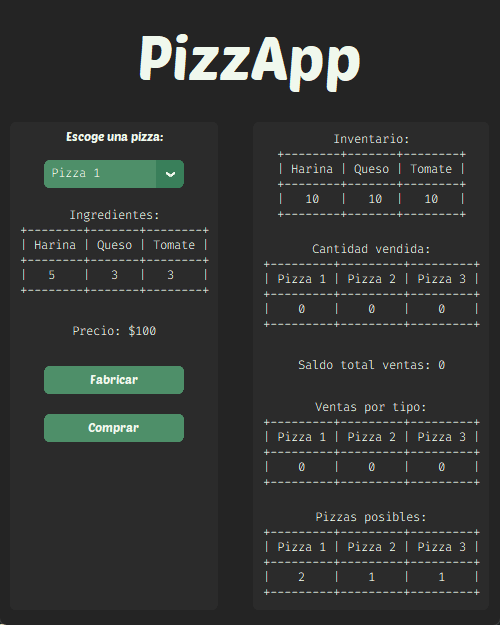
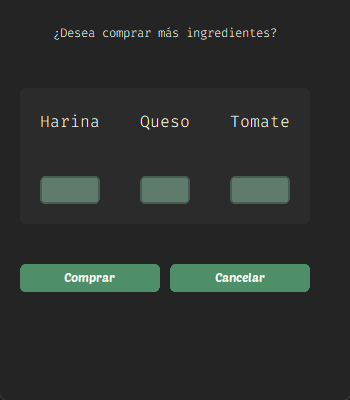

# Proyecto final algebra lineal (PFAL)-(PizzApp)

Todo el codigo contenido en este repositorio está bajo la MIT License.
Este proyecto consiste en la abstraccion de un negocio de pizzas para ejemplificar la aplicabilidad de algebra lineal en programacion.

## Estructuras de datos

### Matriz Pizzas

Cada una de las componentes del vector **pizza[i]** son la cantidad de ingredientes necesarios para crearla.

### Vectores

#### Ventas

Representa el numero de unidades vendidas de cada tipo de pizza.

#### Precios

Representa el valor unitario de cada tipo pizza.

#### Inventario

Representa la cantidad de ingredientes disponibles.

#### Compras

Representa la cantidad de ingredientes comprados.

```python

import numpy as np

pizzas = np.array([[5,3,3],[4,6,2],[7,4,2]])

ventas = np.array([1,2,3])

precios = np.array([100,200,300])

inventario = np.array([10,10,10])

compras = np.array([1,2,3])

```

## Operaciones de algebra lineal y su utilidad

### Suma

Suma del vector **compras** al vector **inventario**.

``` python

#Aumenta el inventario con las compras
nInventario = inventario + compras
print(f"Inventario+ (numpy):{nInventario} ")

def aumentar(inventario, compras):
    # ciclo iterando el vector desde el indice 
    resultado = []
    for i in range(len(ventas)):
        resultado.append(inventario[i] + compras[i])
    return resultado

iInventario = aumentar(inventario, compras)
print(f"Inventario+ (ciclo): {iInventario}")

```

### Resta

Resta del vector **inventario** al vector **pizza[i]** fabricada.

``` python

# Descuenta las pizzas vendidas del inventario
nDescuento = inventario - pizzas[1]
print(f"Inventario- (numpy): {nDescuento} ")

def descontar(inventario, pizza):
    # ciclo iterando el vector desde el indice 
    resultado = []
    for i in range(len(ventas)):
        resultado.append(inventario[i] - pizza[i])
    return resultado

iDescuento = descontar(inventario, pizzas[1])
print(f"Inventario- (ciclo): {iDescuento}")

```

### Producto punto

Producto punto entre el vector **precio** y vector **ventas** para el calculo de las ganancias totales.

``` python

# Calcula el total de ventas
total_ventas = np.dot(ventas,precios)
print(f"Total de ventas (numpy): {total_ventas}")

def total_ventas(ventas, precios):
    # ciclo iterando el vector desde el indice 
    total = 0
    for i in range(len(ventas)):
        total += ventas[i] * precios[i]
    return total

total_ventas = total_ventas(ventas, precios)

print(f"Total ventas (ciclo): {total_ventas}")

```

### Multiplicacion

Multiplicacion componente a componente entre el vector **precio** y el vector **ventas** para el calculo de las ganancias por cada tipo de pizza.

``` python

#Calcula la cantidad de pizzas vendidas de cada tipo 
nTotal_pizza = ventas * precios
print(f"Ventas por pizza (numpy): {nTotal_pizza} ")

def ventas_tipo(ventas, precios):
    # ciclo iterando el vector desde el indice 
    resultado = []
    for i in range(len(ventas)):
        resultado.append(ventas[i] * precios[i])
    return resultado

iTotal_pizza = ventas_tipo(ventas, precios)
print(f"Total ventas (ciclo): {iTotal_pizza}")

```

### ScreenShots





### Resolución de sistemas

A unas ganancias obtenidas calcular la cantidad de pizzas y sus tipos.

## Librerias utilizadas y su proposito

### [CustomTkinter](https://github.com/TomSchimansky/CustomTkinter)

Libreria para la creacion de la interfaz grafica

### [Numpy](https://numpy.org/)

Libreria que contiene los metodos para la creacion de las estructuras y operaciones de algebra lineal implementadas

### [PrettyTable](https://pypi.org/project/prettytable/)

Libreria para organizar en tablas ascii la información.

## Instalacion

Instalar con **pip** las librerias requeridas

``` powershell

pip install -r requirements.txt

```

Si no se tiene **pip** instalado, revisar la [documentación](https://pip.pypa.io/en/stable/installation/)

## Uso

El repositorio contiene estos archivos.

### [PFAL](PFAL.py)

Librearia construida a partir de OOP, contiene las estructuras y metodos explicados anteriormente.

### [PFAL_GUI](PFAL_GUI.py)

Archivo principal del proyecto, construido a partir de OOP, contiene la estructura de la interfaz grafica, importa la libreria anterior. Este es el archivo que debe ser ejecutado para el inicio de la aplicación.

## Referencias adicionales

- [Documentación de CustomTkinter](https://customtkinter.tomschimansky.com/documentation/)
- [Ejemplo de formulario GUI con Customtkinter](https://www.geeksforgeeks.org/build-a-basic-form-gui-using-customtkinter-module-in-python/)
- [Tema (marsh)](https://github.com/a13xe/CTkThemesPack)
- [Lista de reproduccion sobre CustomTkinter](https://www.youtube.com/watch?v=Y01r643ckfI&list=PLfZw_tZWahjxJl81b1S-vYQwHs_9ZT77f)
- [TkinterDesigner (No utilizado en el proyecto)](https://github.com/ParthJadhav/Tkinter-Designer)

## Todo

- [x] Creacion de la pantalla de compra
- [x] Documentar el codigo.
- [ ] Creacion de la ventana de resolucion de sistemas

### Opcionales

- [ ] Añadir iconos y/o imagenes
- [ ] Pensar en una ventana de administracion

Este proyecto no pretende demostrar buenas practicas de programacion, ni en la libreria construida, ni en su interfaz grafica.
