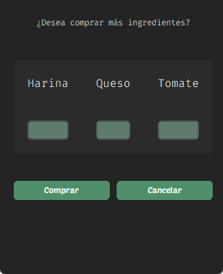

# Proyecto final algebra lineal (PFAL)-(PizzApp)

Todo el codigo contenido en este repositorio está bajo la MIT License.

Este proyecto consiste en la abstraccion de un negocio de pizzas para ejemplificar la aplicabilidad de algebra lineal en programacion.

## Estructuras de datos

### Matriz Pizzas

Cada una de las componentes del vector **pizza[i]** son la cantidad de ingredientes necesarios para crearla.

### Vectores

#### Ventas

Representa el numero de unidades vendidas de cada tipo de pizza.

#### Precios

Representa el valor unitario de cada tipo pizza.

#### Inventario

Representa la cantidad de ingredientes disponibles.

#### Compras

Representa la cantidad de ingredientes comprados.

```python

import numpy as np

pizzas = np.array([[5,3,3],[4,6,2],[7,4,2]])

ventas = np.array([1,2,3])

precios = np.array([100,200,300])

inventario = np.array([10,10,10])

compras = np.array([1,2,3])

```

## Operaciones de algebra lineal y su utilidad

``` python
def verificar(vector):
  """Verifica que todos los elementos de un vector sean enteros positivos"""
  if (vector < 0).any() or (vector % 1 != 0).any():
    return False
  return True

```

### Suma

Suma del vector **compras** al vector **inventario**.

``` python

def comprar(self,lista):
    """Agrega ingredientes de la compra al inventario"""
    compras = np.array(lista) # Convierte una lista en un vector de numpy
    if (verificar(compras)): 
      self.inventario = self.inventario + compras # Suma el vector compras al inventario
      return 0 # Retorna 0 en caso de exito
    else: 
      print("No se puede agregar") 
      return -1 # Retorna -1 en caso de error

nInventario = comprar(self,lista)
print(f"Inventario+ (numpy):{nInventario} ")


def comprar_i(inventario, compras):
    # ciclo iterando el vector desde el indice 
    resultado = [] # Creacion de un vector vacio para el resultado
    for i in range(len(ventas)):
        resultado.append(inventario[i] + compras[i]) # Añade la suma de cada componente al nuevo vector
    return resultado # Retorna el vector resultante

iInventario = comprar_i(inventario, compras)
print(f"Inventario+ (ciclo): {iInventario}")

```

### Resta

Resta del vector **inventario** al vector **pizza[i]** fabricada.

``` python

def fabricar(self, tipo):
    """Fabrica la pizza descontando los ingredientes del inventario."""
    temp = self.inventario - self.pizzas[tipo] # Crea un vector temporal con el resultado
    if (verificar(temp)): # Verifica que el vector no contenga numeros negativos
      self.inventario = temp # redefine el inventario como el vector temporal
      self.ventas[tipo] = self.ventas[tipo] + 1 # Aumenta en una unidad el componente del vector ventas.
      return 0 # Retorna 0 en caso de exito
    else:
      print("No hay suficiente inventario")
      return -1 # Retorna -1 en caso de error

nDescuento = fabricar(inventario, 1)
print(f"Inventario- (ciclo): {iDescuento}")

def fabricar_i(inventario, tipo):
    # ciclo iterando el vector desde el indice 
    resultado = [] # Creacion de un vector vacio para el resultado
    for i in range(len(ventas)):
        resultado.append(inventario[i] - pizza[tipo])# Añade la resta de cada componente al nuevo vector
    return resultado # Retorna el vector resultante

iDescuento = fabricar_i(inventario, pizzas[1])
print(f"Inventario- (ciclo): {iDescuento}")

```

### Producto punto

Producto punto entre el vector **precio** y vector **ventas** para el calculo de las ganancias totales.

``` python

def total_ventas(self):
    """Calcula el valor total de las ventas"""
    return np.dot(self.ventas, self.precios) # Retorna el producto punto entre ventas y precios

ntotal_ventas = total_ventas()
print(f"Total ventas (numpy): {total_ventas}")

def total_ventas_i(ventas, precios):
    # ciclo iterando el vector desde el indice 
    total = 0 # Creacion de una variable para almacenar el total
    for i in range(len(ventas)):
        total += ventas[i] * precios[i] # Suma al total la multiplicacion de cada componente en la posicion i de ventas y precios.
    return total # Retorna el valor resultante

itotal_ventas = total_ventas_i(ventas, precios)

print(f"Total ventas (ciclo): {total_ventas}")

```

### Multiplicacion

Multiplicacion componente a componente entre el vector **precio** y el vector **ventas** para el calculo de las ganancias por cada tipo de pizza.

``` python

def ventas_tipo(self):
    """Calcula el valor de las ventas por tipo de pizza"""
    return self.ventas * self.precios # Retorna la multiplicacion por componente 
    
nTotal_pizza = ventas_tipo()
print(f"Ventas por pizza (numpy): {nTotal_pizza} ")

def ventas_tipo_i(ventas, precios):
    # ciclo iterando el vector desde el indice 
    resultado = [] # Creacion de un vector vacio para el resultado
    for i in range(len(ventas)):
        resultado.append(ventas[i] * precios[i])# Añade la multiplicacion de cada componente al nuevo vector
    return resultado # Retorna el vector resultante

iTotal_pizza = ventas_tipo_i(ventas, precios)
print(f"Total ventas (ciclo): {iTotal_pizza}")

```

### Resolución de sistemas

A unas ganancias obtenidas calcular la cantidad de pizzas y sus tipos.

### ScreenShots




## Librerias utilizadas y su proposito

### [CustomTkinter](https://github.com/TomSchimansky/CustomTkinter)

Libreria para la creacion de la interfaz grafica

### [Numpy](https://numpy.org/)

Libreria que contiene los metodos para la creacion de las estructuras y operaciones de algebra lineal implementadas

### [PrettyTable](https://pypi.org/project/prettytable/)

Libreria para organizar en tablas ascii la información.

## Instalacion

Instalar con **pip** las librerias requeridas

``` powershell

pip install -r requirements.txt

```

Si no se tiene **pip** instalado, revisar la [documentación](https://pip.pypa.io/en/stable/installation/)

Para la visualizacion correcta de las tablas construidas se debe utilizar una fuente monoespaciada. esta app hace uso de:

- [Tipografia (Fira Code)](https://github.com/tonsky/FiraCode)
  - [Google Fonts](https://fonts.google.com/specimen/Fira+Code)

## Uso

El repositorio contiene estos archivos.

### [PFAL](PFAL.py)

Librearia construida a partir de OOP, contiene las estructuras y metodos explicados anteriormente.

### [PFAL_GUI](PFAL_GUI.py)

Archivo principal del proyecto, construido a partir de OOP, contiene la estructura de la interfaz grafica, importa la libreria anterior. Este es el archivo que debe ser ejecutado para el inicio de la aplicación.

## Referencias adicionales

- [Documentación de CustomTkinter](https://customtkinter.tomschimansky.com/documentation/)
- [Ejemplo de formulario GUI con Customtkinter](https://www.geeksforgeeks.org/build-a-basic-form-gui-using-customtkinter-module-in-python/)
- [Tema (marsh)](https://github.com/a13xe/CTkThemesPack)
- [Lista de reproduccion sobre CustomTkinter](https://www.youtube.com/watch?v=Y01r643ckfI&list=PLfZw_tZWahjxJl81b1S-vYQwHs_9ZT77f)
- [TkinterDesigner (No utilizado en el proyecto)](https://github.com/ParthJadhav/Tkinter-Designer)
- [Tipografia (Fira Code)](https://github.com/tonsky/FiraCode)
  - [Google Fonts](https://fonts.google.com/specimen/Fira+Code)

## Todo

- [x] Creacion de la pantalla de compra
- [x] Documentar el codigo.
- [ ] Creacion de la ventana de resolucion de sistemas

### Opcionales

- [ ] Añadir iconos y/o imagenes
- [ ] Pensar en una ventana de administracion

>[!NOTE]
> Este proyecto no pretende demostrar buenas practicas de programacion, ni en la libreria construida, ni en su interfaz grafica. Primera y ultima vez utilizando CustomTkinter.
